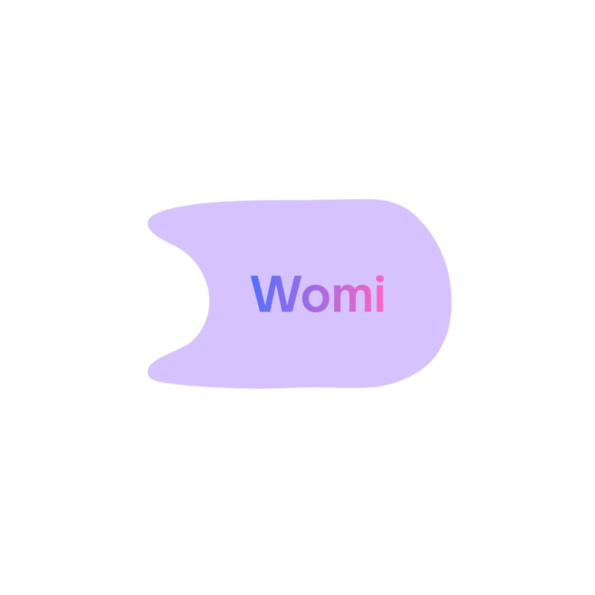

<div align="center">



# 🚗 Womi

**Movilidad segura, diseñada exclusivamente para mujeres.**

[](https://flutter.dev)
[](https://dart.dev)
[]()
[]()

</div>

---

## ✨ ¿Qué es Womi?

Womi es una app de ride-hailing estilo Uber, diseñada desde cero para **mujeres**.  
Tanto pasajeras como conductoras pasan por un proceso de **verificación de identidad** que garantiza un entorno confiable y seguro.

> 🌸 **Lavanda `#C7B1F6` · Azul Real `#5A75E6` · Magenta `#E94EAB`**

---

## 🎯 Funcionalidades principales

| Feature | Descripción |
|---|---|
| 🔐 **Registro y login local** | Sistema de autenticación con Hive + contraseñas hasheadas (sha256) |
| 🗺️ **Búsqueda real de destinos** | Geocoding con Nominatim (OpenStreetMap), búsqueda libre de lugares en México |
| 🚕 **Flujo de viaje completo** | Destino → Buscar conductora → Viaje activo (mapa animado) → Viaje completado |
| 👩‍✈️ **Conductora verificada** | Datos de conductora + auto + rating durante el viaje activo |
| 🆘 **Botón SOS pulsante** | Emergencia con un solo toque, diálogo de confirmación |
| 🏦 **Billetera virtual** | Saldo Womi + tarjetas vinculadas (Visa/MC/AMEX) con diseño premium |
| 🪪 **Verificación INE** | Flujo de 4 pantallas: captura frontal INE, reverso, selfie, procesamiento |
| 👤 **Perfil completo** | Edición de datos, foto de perfil, cambiar contraseña, eliminar cuenta |
| 📋 **Historial de viajes** | Actividades guardadas automáticamente al completar viajes |
| 🌐 **Maps sin API key** | flutter_map + OpenStreetMap — sin costos ni límites |

---

## 🖼️ Capturas del flujo de viaje

<div align="center">

Paso el logo de Womi a un renderizado visual tipo captura.

| Buscar destino | Viaje activo | Viaje completado |
|---|---|---|
| `DestinationSearchScreen` | `ActiveRideScreen` | `RideCompletedScreen` |

</div>

---

## 🏗️ Arquitectura

```
lib/
├── core/theme/        Sistema de diseño centralizado
│   ├── app_colors.dart
│   ├── app_gradients.dart
│   ├── app_text_styles.dart
│   ├── app_dimensions.dart
│   ├── app_shadows.dart
│   └── app_theme.dart
├── core/router/       Rutas nombradas
├── core/utils/        Validadores, formatters, JsonUtils
├── shared/widgets/    WomiCard, WomiGradientButton, WomiGradientText, WomiBottomNav, WomiDialog
├── features/auth/     Autenticación local (Hive)
├── features/home/     Pantalla de inicio
├── features/activity/ Historial de viajes
├── features/wallet/   Billetera virtual
├── features/profile/  Perfil, edición, seguridad, ajustes
├── features/ride/     Flujo de viaje (4 pantallas)
├── features/map/      Búsqueda de destinos (Nominatim)
└── features/verification/ Verificación de identidad (INE + selfie)
```

---

## 🛠️ Stack tecnológico

| Categoría | Tecnología |
|---|---|
| Framework | Flutter 3.x (Dart) |
| Estado | Provider |
| Storage | Hive + SharedPreferences |
| Mapas | flutter_map + OpenStreetMap |
| Geocoding | Nominatim API (gratis) |
| Cámara | camera + image_picker |
| Hashing | crypto (sha256) |
| Tipografía | Google Fonts (Quicksand + Inter) |
| Transiciones | FadeUpwardsPageTransitionsBuilder |

---

## 🚀 Empezar

```bash
# Clonar
git clone https://github.com/dachugamer33333/Womi.git
cd Womi

# Instalar dependencias
flutter pub get

# Generar íconos (requiere logo en assets/womi_logo.png de 1024x1024)
flutter pub run flutter_launcher_icons

# Correr en debug
flutter run
```

---

## 📋 Reglas no negociables del proyecto

1. **Cero `Color(0xFF...)` hardcodeado.** Todo viene de `AppColors`.
2. **Cero números mágicos.** Todo de `AppDimensions`.
3. **Cero `TextStyle()` inline.** Todo de `AppTextStyles` o `Theme.of(context)`.
4. **Cada pantalla** debe tener al menos un elemento con `AppGradients.brand`.
5. **Contraseñas SIEMPRE** hasheadas con sha256.
6. **AuthProvider** es el único punto de acceso a AuthRepository desde la UI.
7. **No modificar** `lib/core/theme/` sin justificación documentada.

---

## 👩‍💻 Para el agente (OpenCode / Claude Code)

Lee `AGENTS.md` al abrir el proyecto. Contiene:
- Estructura completa del proyecto
- Estado actual de implementación (✅/🚧/⬜)
- Convenciones de código
- Comandos útiles

---

<div align="center">
<sub>Hecho con 💜 en CDMX · Womi 2026</sub>
</div>
